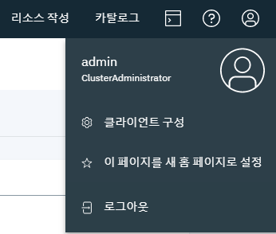
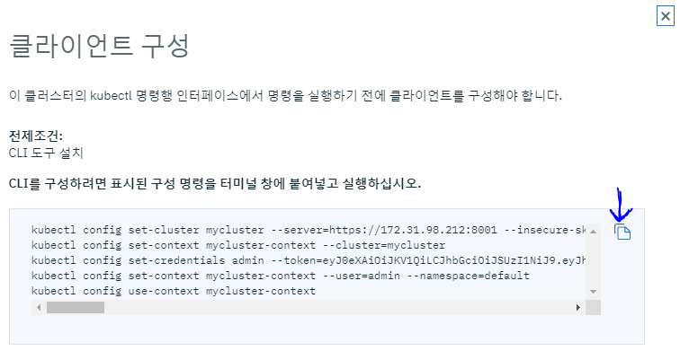

# Kubectl - 치트 시트


> kubectl CLI 사용전 kubectl 클라이언트 설정 필요

1. ICP Console Login
2. 클라이언트 구성

    https://172.31.98.212:8443/

    

3. 5개 명령줄 복사 (or 아이콘 클릭)

    


4. 명령줄 실행 (클라이언트에서)


---

## 클러스터 정보 보기

```
kubectl cluster-info
```


## 노드 정보

```
kubectl get nodes
```


## 간단한 정보 확인 (namespace : daishin)

```
kubectl get po -n daishin                           # Pod 정보 확인
kubectl get ing -n daishin                          # Ingress 정보 확인
kubectl get deploy -n daishin                       # Deployment 정보 확인
kubectl get configmap -n daishin                    # ConfigMap 정보 확인
kubectl get svc -n daishin                          # Service 정보 확인
```


## Apply

apply는 쿠버네티스 리소스를 정의하는 파일을 통해 애플리케이션을 관리 합니다.
kubectl appy를 실행하여 클러스터에 리소스를 생성하고 업데이트 합니다.
이것은 프로덕션 환경에서 쿠버네티스 애플리케이션을 관리할 때 권장됩니다.


## 오브젝트 생성

>쿠버네티스 매니페스트는 json이나 yaml로 정의
>
>적용되는 파일 확장자 : .yaml, .yml, .json

```
kubectl apply -f ./ingress.yaml -n daishin          # daishin 네임스페이스의 Ingress 리소스 생성
kubectl apply -f ./service.yaml -n daishin          # daishin 네임스페이스의 Service 리소스 생성
kubectl apply -f ./config.yaml -n daishin           # daishin 네임스페이스의 ConfigMap 리소스 생성
kubectl apply -f ./deploy.yaml -n daishin           # daishin 네임스페이스의 Deployment 리소스 생성
```


## 리소스 조회 및 찾기

```
# 기본 출력을 위한 Get 커맨드

kubectl get services                                # 네임스페이스 내 모든 서비스의 목록 조회
kubectl get pods --all-namespaces                   # 모든 네임스페이스 내 모든 파드의 목록 조회
kubectl get pods -o wide                            # 네임스페이스 내 모든 파드의 상세 목록 조회
kubectl get deployment -n daishin                   # daishin 네임스페이스의 디플로이먼트의 목록 조회
kubectl get pods -n daishin                         # daishin 네임스페이스의 모든 파드의 목록 조회
kubectl get pod <pod_name> -n daishin -o yaml       # daishin 네임스페이스의 특정 파드의 YAML 조회


# 리소스 yaml 내용 확인

kubectl get ing -n daishin -o yaml                  # daishin 네임스페이스의 Ingress yaml 내용 확인
kubectl get svc -n daishin -o yaml                  # daishin 네임스페이스의 Service yaml 내용 확인
kubectl get deploy -n daishin -o yaml               # daishin 네임스페이스의 Deployment yaml 내용 확인


# 상세 출력을 위한 Describe 커맨드

kubectl describe pods <pod_name> -n daishin         # daishin 네임스페이스 <pod_name>의 상세 정보
kubectl describe po <pod_name> -n daishin           # daishin 네임스페이스 <pod_name>의 상세 정보
```


## 리소스 삭제

```
kubectl delete -f ./ingress.yaml -n daishin          # daishin 네임스페이스의 Ingress 리소스 삭제
kubectl delete -f ./service.yaml -n daishin          # daishin 네임스페이스의 Service 리소스 삭제
kubectl delete -f ./config.yaml -n daishin           # daishin 네임스페이스의 ConfigMap 리소스 삭제
kubectl delete -f ./deploy.yaml -n daishin           # daishin 네임스페이스의 Deployment 리소스 삭제
```

## 로그 보기

```
kubectl logs <pod_name> -n daishin                  # daishin 네임스페이스 특정 파드 로그 확인 (주의: 로그 출력이 많을 수 있음)
kubectl logs <pod_name> -n daishin --tail=100       # daishin 네임스페이스 특정 파드 로그 tail (100Line) 
kubectl logs <pod_name> -n daishin -f --tail=1      # daishin 네임스페이스 특정 파드 로그 스트리밍 
```


## Pod 안으로 접속 

```
kubectl exec -it <pod_name> -n daishin sh           # daishin 네임스페이스 특정 파드에 sh쉘 접속
```


